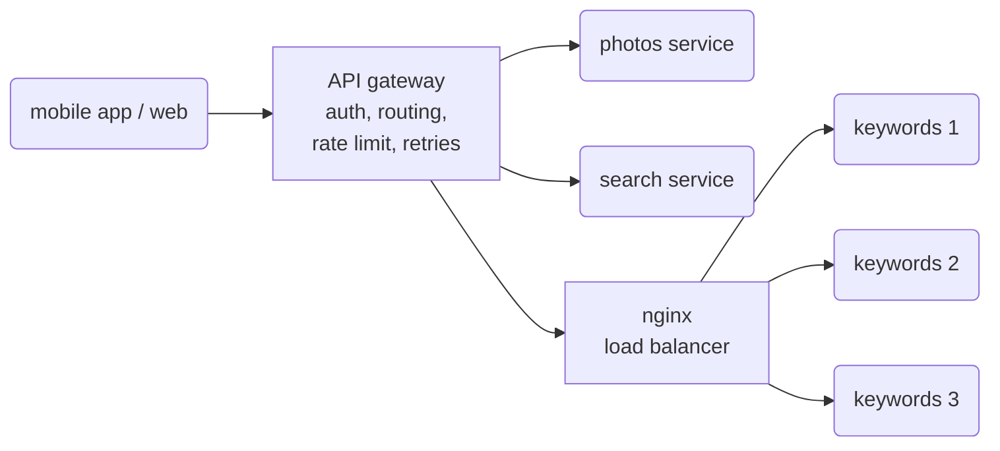

# 04 · Microservices and an API gateway

The photo service answers requests of the mobile app and the web page: photo data, keywords
from the object detection model, and search ([dataset](../photo-data/)). This project splits
it into small services behind one API gateway.

**Problem.** One large program is hard to scale: the model needs much more computing power
than the rest, and a slow or broken part affects everything. But when the parts are separate
services, each call between them goes over the network: it is slower, and it can fail.

**Idea.** Split the system into services with one job and their own data each (photos,
keywords, search). Run more instances of the service that needs them (the stateless model)
behind a load balancer. Put an API gateway in front of all services: the one entry point for
the clients, which checks who calls, routes the request, limits the requests per user, and
tries again when a service does not answer. Bundle calls where possible, because each remote
call costs time.



The gateway checks the token and the rate limit, and then calls the services (`services.py`):

```python
@app.get("/api/search")
def search(q: str, request: Request, bundle: bool = True) -> dict:
    uid = user(request)  # 401 without a valid token, 429 above 20 requests per second
    ids = get("search", f"/search?q={q}&user_id={uid}")
    if bundle:  # one call for all photos
        found = get("photos", f"/photos?ids={','.join(map(str, ids))}") if ids else []
    else:  # one call per photo
        found = [get("photos", f"/photos/{i}") for i in ids]
```

nginx sends each request to the next instance, and to another instance when one fails
(`nginx.conf`):

```nginx
upstream keywords {
  server keywords:8000 max_fails=1 fail_timeout=10s;
}
```

## What the code shows

- `compose.yaml`: the gateway (the only port that is open, 8080), the photo service, the
  search service, 3 instances of the keyword service, and nginx as their load balancer.
- `demo.py`:
  1. Without a token, the gateway answers 401; with a token, it returns the photo; an
     unknown photo gives 404.
  2. A search for "christmas tree" of the user `ckaestne` finds 89 photos. With one call per
     photo, the gateway makes 90 remote calls (about 240 ms); with one bundled call, 2 calls
     (about 20 ms). A lookup in the memory of one process takes less than a microsecond.
  3. 30 keyword requests are spread over the 3 instances (about 10 each).
  4. One instance stops: the next 30 requests all succeed, answered by the other two.
  5. 30 requests of one user in a row: 20 are answered, 10 get 429 (too many requests).

The times change a little from run to run.

## Tools

- [FastAPI](https://fastapi.tiangolo.com) with [uvicorn](https://www.uvicorn.org): a web
  framework and server for REST APIs. Here: the four services.
- [HTTPX](https://www.python-httpx.org): an HTTP client. Here: the gateway calls the
  services, and `demo.py` calls the gateway.
- [nginx](https://nginx.org): a web server and reverse proxy. Here: the load balancer of the
  keyword service, with retries on another instance.
- [Docker Compose](https://docs.docker.com/compose/): starts the services, with 3 replicas of
  the keyword service.

## Run

With [Docker](https://docs.docker.com/get-docker/) and [uv](https://docs.astral.sh/uv/):

```sh
docker compose up -d --build
curl -H "Authorization: Bearer token-ckaestne" localhost:8080/api/photos/133422131
uv run demo.py
docker compose down -v
```
