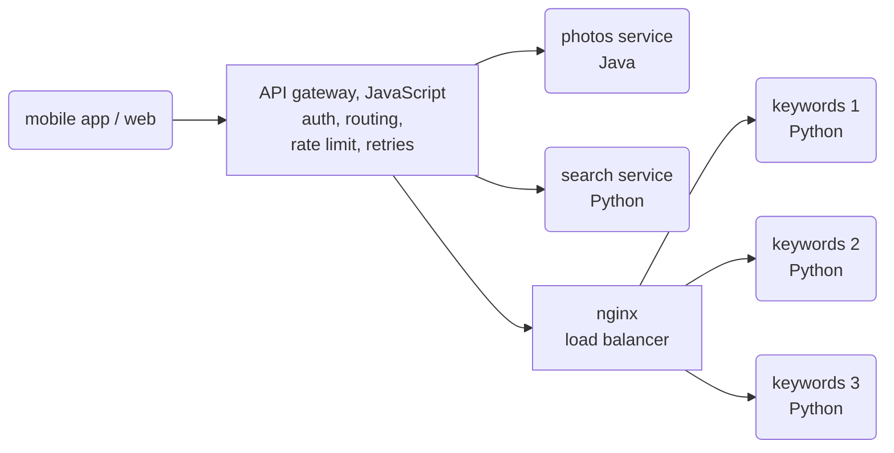

# 04 · Microservices and an API gateway

The photo service answers requests of the mobile app and the web page: photo data, keywords
from the object detection model, and search ([dataset](../photo-data/)). This project splits
it into small services behind one API gateway. Each service is a separate program in its own
container, and the services use three languages: Python, JavaScript, and Java.

**Problem.** One large program is hard to scale: the model needs much more computing power
than the rest, and a slow or broken part affects everything. But when the parts are separate
services, each call between them goes over the network: it is slower, and it can fail.

**Idea.** Split the system into services with one job and their own data each (photos,
keywords, search). Run more instances of the service that needs them (the stateless model)
behind a load balancer. Put an API gateway in front of all services: the one entry point for
the clients, which checks who calls, routes the request, limits the requests per user, and
tries again when a service does not answer. Bundle calls where possible, because each remote
call costs time. Because the services only talk over HTTP and JSON, each team can select the
language that fits its service: Python for the model, JavaScript (Node.js) for the gateway, and
Java for the photo service.



Each service has its own folder with its code, its dependencies, and a `Dockerfile`:

| Folder | Language | Job | Its data |
|---|---|---|---|
| [`gateway/`](gateway/) | JavaScript (Node.js, no packages) | authentication, routing, rate limits, retries | `users.csv` |
| [`photos/`](photos/) | Java (only the JDK) | the metadata of the photos | `photos.csv` |
| [`search/`](search/) | Python (FastAPI) | an index from keywords to photos | `photos.csv` |
| [`keywords/`](keywords/) | Python (FastAPI) | the object detection model (stateless, 3 instances) | `photos.csv` |

Each image gets its own copy of the data that it needs, from the CSV files of the
[dataset](../photo-data/data/tables/). No service reads the data of another service: it calls
the service instead.

The gateway checks the token and the rate limit, and then calls the services
(`gateway/gateway.js`):

```js
[/^\/api\/search$/, async (request, _, params) => {
  const uid = user(request); // 401 without a valid token, 429 above 20 requests per second
  const ids = await get("search", `/search?q=${encodeURIComponent(q)}&user_id=${uid}`);
  if (bundle) { // one call for all photos
    found = ids.length ? await get("photos", `/photos?ids=${ids.join(",")}`) : [];
  } else { // one call per photo
    found = [];
    for (const id of ids) found.push(await get("photos", `/photos/${id}`));
  }
```

The photo service answers with the HTTP server of the JDK (`photos/PhotosService.java`):

```java
HttpServer server = HttpServer.create(new InetSocketAddress(8000), 0);
server.createContext("/photos", PhotosService::handle);
server.setExecutor(Executors.newVirtualThreadPerTaskExecutor());
```

The keyword service is the "model" (`keywords/keywords.py`):

```python
@app.get("/keywords/{photo_id}")
def keywords(photo_id: int) -> dict:
    rng = random.Random(photo_id)
    time.sleep(rng.uniform(0.05, 0.15))  # model inference
    objects = [o for o in truth[photo_id] if rng.random() < 0.9]
    return {"photo_id": photo_id, "keywords": objects, "instance": HOST}
```

nginx sends each request to the next instance, and to another instance when one fails
(`nginx.conf`):

```nginx
upstream keywords {
  server keywords:8000 max_fails=1 fail_timeout=10s;
}
```

## What the code shows

- `compose.yaml`: builds one image from the folder of each service: the gateway (the only
  port that is open, 8080), the photo service, the search service, 3 instances of the keyword
  service, and nginx as their load balancer. The build context `data` gives each `Dockerfile`
  the CSV files of the dataset.
- `demo.py`:
  1. Without a token, the gateway answers 401; with a token, it returns the photo; an
     unknown photo gives 404.
  2. A search for "christmas tree" of the user `ckaestne` finds 89 photos. With one call per
     photo, the gateway makes 90 remote calls (about 240 ms); with one bundled call, 2 calls
     (about 20 ms). A lookup in the memory of one process takes less than a microsecond.
  3. 30 keyword requests are spread over the 3 instances (about 10 each).
  4. One instance stops: the next 30 requests all succeed, answered by the other two.
  5. 30 requests of one user in a row: 20 are answered, 10 get 429 (too many requests).

The times change a little from run to run.

## Tools

- [FastAPI](https://fastapi.tiangolo.com) with [uvicorn](https://www.uvicorn.org): a Python
  web framework and server for REST APIs. Here: the search and keyword services.
- [Node.js](https://nodejs.org): a JavaScript runtime for servers, with an HTTP server
  (`node:http`) and an HTTP client (`fetch`). Here: the gateway.
- [Java](https://openjdk.org) (the JDK, [Eclipse Temurin](https://adoptium.net) images): the
  HTTP server `com.sun.net.httpserver`. Here: the photo service.
- [HTTPX](https://www.python-httpx.org): a Python HTTP client. Here: `demo.py` calls the
  gateway.
- [nginx](https://nginx.org): a web server and reverse proxy. Here: the load balancer of the
  keyword service, with retries on another instance.
- [Docker](https://docs.docker.com/) and [Docker Compose](https://docs.docker.com/compose/):
  builds an image for each service from its `Dockerfile`, and starts the services, with 3
  replicas of the keyword service.

## Run

With [Docker](https://docs.docker.com/get-docker/) and [uv](https://docs.astral.sh/uv/):

```sh
docker compose up -d --build
curl -H "Authorization: Bearer token-ckaestne" localhost:8080/api/photos/133422131
uv run demo.py
docker compose down -v
```

To change one service, build and start only that service again, for example
`docker compose up -d --build photos`. The other services continue to run.
