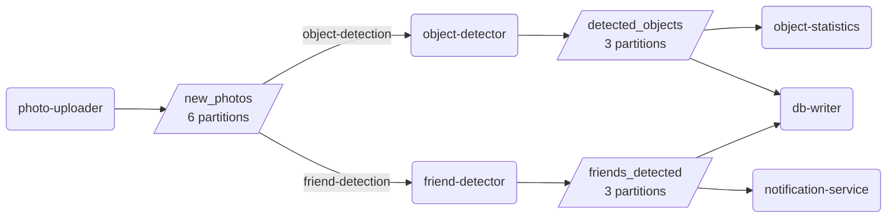

# 06 · Stream processing with Kafka

Users of the photo service upload photos. After each upload, several components must do
their work: an object detector (a model) adds keywords for the search, a friend detector (a
second model) finds friends in the photo, a notification service tells these friends, a
statistics component counts objects, and a database writer stores the results. This project
replays the 523 uploads of three days ([dataset](../photo-data/)) through such a system.

**Problem.** If the upload service calls each component directly, it must know all of them,
wait for slow model inference, and fail when one component is down. The load also changes:
there are many more uploads in the evening, and some users upload much more than others.

**Idea.** Components communicate through a message broker. The uploader publishes a message
to the topic `new_photos` and is done. Each consumer group gets every message; the instances
in a group share the partitions of the topic, so more instances process more messages. The
broker keeps the messages: a slow consumer falls behind (lag) instead of blocking the
producer, and a new consumer can read old messages again.

Each component declares what it consumes and produces; the object detector reads new photos,
"runs the model" (a delay and the true objects with some mistakes), and publishes the result:

```python
@component("object-detector", ["new_photos"], ["detected_objects"], group="object-detection")
def object_detector():
    def handle(photo, msg, p):
        rng = random.Random(photo["photo_id"])  # the same answer if a photo is processed twice
        time.sleep(rng.uniform(0.15, 0.45))
        found = [o for o in truth[photo["photo_id"]] if rng.random() < 0.9]
        send(p, "detected_objects", photo["photo_id"], {"photo_id": ..., "objects": found})
```

All components use the same loop: process a message, then mark it as processed. If a
component crashes in between, the message is processed again (at-least-once):

```python
handle(json.loads(msg.value()), msg, p)
if p:
    p.flush()  # the results are stored in Kafka before the input counts as processed
c.store_offsets(msg)
```

The data flow, generated from these declarations by `dataflow.py`:

<!-- dataflow -->

<!-- /dataflow -->

## What the code shows

- `compose.yaml`: the running system: Kafka (one broker), two uploaders (app and web), 3
  object detectors, 2 friend detectors, and one instance of each other component.
- `check_system.py` waits until all 523 photos have keywords, then shows the state:
  - The key of each message is the user, so all photos of a user are in one partition. The
    partitions are not equal: `[135, 41, 181, 47, 42, 77]` messages; the most active user
    uploaded 94 of the 523 photos.
  - Each consumer group got all messages; the 3 object detectors share the 6 partitions (2
    each). The database has 689 writes for 689 results; the notification service sent 286
    notifications.
- `demo_scaling.py`: new consumer groups with 1 to 8 workers read all 523 messages again
  (Kafka keeps them). More workers are faster, up to the limits of the partitions (the times
  of two runs; they change by a few seconds from run to run):

  | workers | time | photos/s | why |
  |---:|---:|---:|---|
  | 1 | 52 s | 10 | one worker, 0.1 s per photo |
  | 3 | 23–26 s | 20–23 | 2 partitions each, but the busiest worker has 228 messages |
  | 6 | 18–21 s | 25–29 | one partition each: the partition with 181 messages is the bottleneck |
  | 8 | 20–21 s | 25–26 | only 6 partitions: 2 workers get nothing |

- `demo_delivery.py`: a billing consumer crashes while it processes order 4 of 8:

  | mode | charged orders | lost | charged twice |
  |---|---|---|---|
  | at-most-once (commit, then charge) | 1, 2, 3, 5, 6, 7, 8 | 4 | – |
  | at-least-once (charge, then commit) | 1, 2, 3, 4, 4, 5, 6, 7, 8 | – | 4 |
  | at-least-once + idempotent charge | 1, 2, 3, 4, 5, 6, 7, 8 | – | – |

  Exactly-once processing is not possible, but an idempotent consumer (here: the payment
  service ignores an order id that it has seen) gives the same effect. The database writer of
  the system does the same with an upsert.
- `demo_ordering.py`: 20 photos, each with 4 events in order (add, title, filter, delete),
  applied by 3 consumers. With the photo as key, all events are applied in order. Without a
  key, the events of a photo go to different partitions, and some photos get their events out
  of order (4 to 16 of the 20 photos in our runs), for example
  `deletePhoto -> addPhoto -> updatePhotoData -> replacePhoto`: a deleted photo is visible
  again.
- `object-statistics` (in `components.py`) shows three kinds of stream queries: per event,
  over all events so far (a counter), and per window of 6 hours of upload time. Events can
  arrive late, because partitions are processed at different speeds; the window waits 2 hours
  (upload time) before it reports.

## Tools

- [Apache Kafka](https://kafka.apache.org): a distributed, persistent message broker (event
  log). Here: one broker in Docker, with topics, partitions, and consumer groups.
- [confluent-kafka](https://docs.confluent.io/kafka-clients/python/current/overview.html): the
  Python client of Kafka (based on librdkafka). Here: producers, consumers (also to read the
  lag of a group), and the admin API for topics and groups.
- [Docker Compose](https://docs.docker.com/compose/): starts a set of containers from one
  file. Here: the broker and all components; `--scale` starts more instances.
- [Kafka UI](https://github.com/kafbat/kafka-ui): a web interface for Kafka. Here: optional,
  to look at topics, messages, and consumer groups in class.
- [SQLite](https://sqlite.org): an embedded database. Here: the store of the database writer.

## Run

With [Docker](https://docs.docker.com/get-docker/) and [uv](https://docs.astral.sh/uv/):

```sh
docker compose up -d --build                  # start the system (3 days of uploads in ~1 min)
docker compose logs -f notification-service   # follow one component
docker compose --profile ui up -d             # Kafka UI on http://localhost:8080
uv run check_system.py                        # wait for the end and show the state
uv run demo_scaling.py 1 3 6 8                # consumer groups with 1, 3, 6, 8 workers
uv run demo_delivery.py                       # at-most-once, at-least-once, idempotent
uv run demo_ordering.py                       # order with and without a key
uv run dataflow.py                            # update the diagram in this README
docker compose down -v                        # stop and remove everything
```
