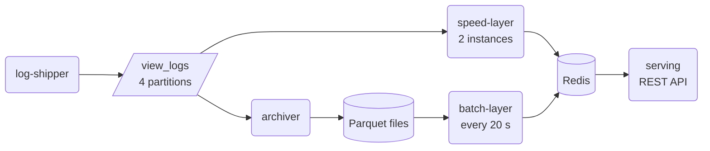

# 08 · Lambda architecture

The photo service shows the number of views for each photo. The views come from the logs of
the 4 web servers ([dataset](../photo-data/)); this project replays the 3 days of logs
(28,888 photo views) through a system in about 90 seconds.

**Problem.** Users expect current numbers. A batch job over all logs gives exact numbers, but
only after it is done, and it runs only now and then. A stream processor that increments a
counter for each view is fast, but its numbers can go wrong and stay wrong: a consumer that
crashes processes some messages again (at-least-once), and there is no way to find and remove
the double counts later.

**Idea.** Three layers work on the same append-only data (a lambda architecture):

- the **batch layer** regularly recomputes the exact counts from *all* stored events, up to
  the last complete hour (the horizon);
- the **speed layer** counts the new events incrementally, in one bucket per hour;
- the **serving layer** answers each request with the batch result plus the speed-layer
  buckets after the horizon.

Each batch run replaces the old result, so a mistake of the speed layer lasts only until the
next batch run.



The batch layer recomputes everything with one query over all files (`components.py`):

```sql
SELECT path, count(*), count(DISTINCT user) FROM read_parquet('out/lake/views/*.parquet')
WHERE type = 'request' AND method = 'GET' AND path LIKE '/st/%'
  AND status IN (200, 304) AND time < ? GROUP BY path
```

The serving layer adds the speed-layer buckets that the batch result does not cover yet:

```python
batch = int(r.hget("batch:views", path) or 0)
buckets = [k for k in r.scan_iter("speed:views:*") if k[12:] >= horizon[:13]]
speed = sum(int(v or 0) for v in (r.hget(k, path) for k in buckets))
return {"photo_id": photo_id, "views": batch + speed, "batch": batch, "speed": speed}
```

## What the code shows

- `compose.yaml`: Kafka, Redis (the store of the serving layer), and the 5 components of
  `components.py`: the log shipper (a producer), the archiver (stores all events as Parquet
  files, a small data lake), the batch layer, 2 instances of the speed layer, and the serving
  layer (a REST API with FastAPI).
- `watch.py` follows the 3 most viewed photos: views = batch + speed (the true number in
  parentheses). After 40 s it kills the speed layer and starts it again. An extract:

  ```text
     s  events up to      batch until          133422578              133422596
    36  2021-12-06T20:56  2021-12-06T06      25 +   73 =  98 ( 97)     29 +  104 = 133 (133)
    42  2021-12-07T01:45  2021-12-06T22     108 +   29 = 137 (137)    140 +   40 = 180 (180)
        the speed layer crashes (kill) and restarts
    50  2021-12-07T00:18  2021-12-06T22     108 +   37 = 145 (128)    140 +   49 = 189 (175)
    56  2021-12-07T12:43  2021-12-06T22     108 +  135 = 243 (218)    140 +  122 = 262 (232)
    62  2021-12-07T17:32  2021-12-07T15     243 +   36 = 279 (279)    253 +   25 = 278 (278)
   122  2021-12-09T00:00  2021-12-09T00     421 +    0 = 421 (421)    356 +    0 = 356 (356)
  ```

  1. At first, only the speed layer has numbers; each batch run moves the horizon forward and
     takes over the older counts.
  2. The speed layer commits its offsets every 5 seconds. After the crash, it processes the
     views since the last commit again: the counts are too high (in the run above, 145
     instead of 128).
  3. The next batch run replaces these counts with exact ones (279).
  4. At the end, the batch layer covers all events: all photos have the exact number of views
     (the script checks a sample of 300 photos).
- The speed layer is sometimes one view ahead of the true number in the table: it has already
  processed a few events after the time shown.

The same structure works for models: the batch layer trains a model on all data (for example,
each night), and the speed layer updates it incrementally with new data until the next
batch run.

## Tools

- [Apache Kafka](https://kafka.apache.org): a persistent message broker. Here: the stream of
  log events (see [`06`](../06-stream-processing/)).
- [Redis](https://redis.io): an in-memory key-value store. Here: the batch result and the
  hourly buckets of the speed layer.
- [DuckDB](https://duckdb.org): an in-process SQL database for analytics. Here: the batch
  layer queries all Parquet files at once.
- [Apache Parquet](https://parquet.apache.org) (with pandas and pyarrow): a columnar file
  format. Here: the append-only store of all events.
- [FastAPI](https://fastapi.tiangolo.com) and [uvicorn](https://www.uvicorn.org): a web
  framework and server for REST APIs. Here: the serving layer.
- [HTTPX](https://www.python-httpx.org): an HTTP client. Here: `watch.py` calls the API.

## Run

With [Docker](https://docs.docker.com/get-docker/) and [uv](https://docs.astral.sh/uv/):

```sh
docker compose up -d --build && uv run watch.py   # start, then watch at once (about 2 min)
curl localhost:8000/photos/133422131/views        # ask the serving layer
docker compose down -v                            # stop and remove everything
```
