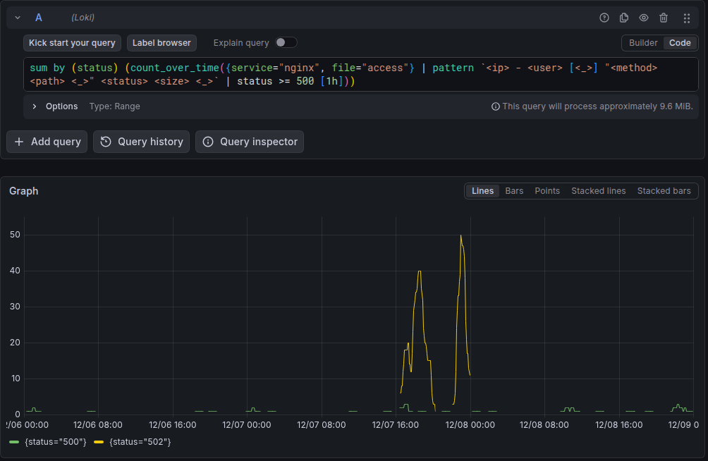

# 09 · A data lake of raw logs

Many parts of the photo service write logs, each in its own format: 4 nginx web servers,
the upload service (JSON lines), the thumbnail service (Python logging), deployments
(logfmt), logins and nightly jobs (syslog), and crash reports of the mobile apps (JSON)
([dataset](../photo-data/), 55,891 lines of three days).

**Problem.** Nobody knows today which questions the logs will need to answer later. If each
log must first get a schema and a parser before it is stored, most logs are never stored,
and the details are lost. If all logs are stored as they are, the lake becomes a "swamp"
unless there are tools to find something in it.

**Idea.** Store the raw lines, with only a time and a few labels (the source), and add the
structure at query time (schema on read). Loki is a log store that indexes only the labels
and keeps the lines compressed as they are. Its query language LogQL filters lines and parses
fields at query time (`pattern`, `regexp`, `json`, `logfmt`), and it computes metrics from
logs. The Drain algorithm finds the templates of the lines without a parser.

The shipper sends each file with two labels; everything else stays in the text
(`ship_logs.py`):

```python
stream = {"stream": labels(path), "values": values[i : i + 1000]}
loki.post("/loki/api/v1/push", json={"streams": [stream]}).raise_for_status()
```

A question that nobody planned: server errors per hour. The fields of the access log exist
only in the query (`investigate.py`):

```sql
sum(count_over_time({service="nginx", file="access"}
  | pattern `<ip> - <user> [<_>] "<method> <path> <_>" <status> <size> <_>`
  | status >= 500 [1h]))
```

## What the code shows

`ship_logs.py` stores the 14 files. Loki keeps 55,449 lines: it stores identical lines with
the same time in the same stream only once. `investigate.py`:

1. What is in the lake: lines per source (50,053 nginx access lines, 1,515 of the upload
   service, ...).
2. The Drain algorithm finds the patterns of the lines without a parser, for example 523
   times `thumbnail created` and 125 times `ERROR ... cannot decode image format=heic`, all
   on 2021-12-07.
3. Question: did anything go wrong with the uploads? There are many server errors on
   2021-12-07 from 16:00 to 23:00: 125 failed uploads (`POST /api/upload 502`) of 7 users.
   The same day, the upload service, the thumbnail service, and the iOS app log errors: 125
   thumbnails fail, all HEIC images, and the iOS app crashes 79 times in `UploadResponse`.
   The deployment log shows the cause: version 2.8.0 of the thumbnailer at 15:52, and the
   rollback at 23:04. Its start message says `pillow-heif not installed`.
4. Question: does someone try to break into accounts? One address (203.0.113.77) has 190
   failed logins, all on 2021-12-08 from 03:05 to 03:24.
5. The truth of the dataset confirms both findings.

In Grafana Explore, the same query shows the two peaks of errors on 2021-12-07:



## Tools

- [Grafana Loki](https://grafana.com/oss/loki/): an open-source store for logs that indexes
  only the labels. Here: the log lake, and LogQL for filters, parsers, and metrics.
- [Grafana](https://grafana.com/oss/grafana/): dashboards and exploration. Here: *Explore*
  for LogQL queries. Grafana also has *Logs Drilldown*, which shows the patterns and fields of
  the logs without queries; it needs recent logs and a plugin that Grafana downloads at the
  first start.
- [Drain3](https://github.com/logpai/Drain3): an implementation of Drain, an algorithm that
  groups log lines into templates. Here: the patterns of the lines from Loki.
- [HTTPX](https://www.python-httpx.org): an HTTP client. Here: the push and query APIs of
  Loki.

## Run

With [Docker](https://docs.docker.com/get-docker/) and [uv](https://docs.astral.sh/uv/):

```sh
docker compose --profile ui up -d   # Loki, and Grafana on http://localhost:3000
uv run ship_logs.py                 # store all log files in Loki (about 1 minute)
uv run investigate.py               # ask the questions
docker compose down -v              # stop and remove everything
```

In Grafana, open *Explore*, select the time range 2021-12-06 to 2021-12-09, and try the
queries of `investigate.py`.
