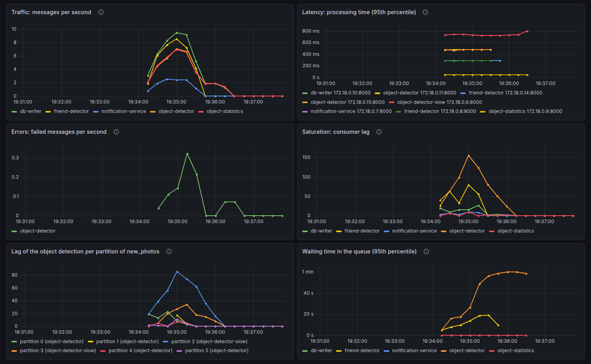
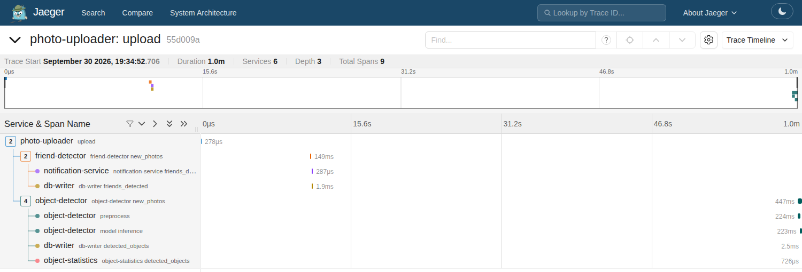

# 10 · Monitoring and profiling a distributed system

This is the stream processing system of the photo service from
[`06`](../06-stream-processing/) (523 uploads of three days, [dataset](../photo-data/)), with
instrumentation. One of the three object detectors (`object-detector-slow`) runs an old
version with a slow preprocessing step.

**Problem.** In a distributed system, a photo passes through many processes on many machines.
When uploads take long to become searchable, which component is the problem: the broker, one
of the models, one instance of a model, or the database? Logs of single processes do not show
where the time goes between them.

**Idea.** Instrument each component. *Metrics* (collected by Prometheus, shown in Grafana)
show the four golden signals for each component and instance: latency, traffic, errors, and
saturation (here: the consumer lag). *Distributed traces* (OpenTelemetry, stored in Jaeger)
follow one photo through all components: each component continues the trace that it gets in
the headers of the Kafka message. A *profiler* then finds the slow function inside one
component.

Each consumer continues the trace of the message it processes and measures the time
(`components.py`):

```python
with TRACER.start_as_current_span(
    f"{name} {msg.topic()}", context=telemetry.extract(msg), kind=SpanKind.CONSUMER
) as span:
    start = time.monotonic()
    handle(json.loads(msg.value()), msg, p)
    PROCESSED.labels(name, msg.topic()).inc()
    DURATION.labels(name).observe(time.monotonic() - start)
```

A producer puts the context of the current span into the message headers (`telemetry.py`):

```python
def inject() -> list[tuple[str, bytes]]:
    carrier: dict[str, str] = {}
    propagate.inject(carrier)
    return [(k, v.encode()) for k, v in carrier.items()]
```

## What the code shows

- `compose.yaml`: the system of `06` plus Jaeger, Prometheus, and Grafana. Prometheus finds
  all instances of each component through the DNS names of the compose services.
- The Grafana dashboard "Photo service" (`grafana/dashboards/photos.json`) during a run:

  

  - Latency: `object-detector-slow` needs 0.73 s per photo (95th percentile), the other
    two instances 0.48 s.
  - Errors: the object detectors cannot read screenshots (17 PNG files).
  - Saturation: the partitions 2 and 3 of `new_photos` fall behind: they belong to the slow
    instance (up to 89 messages).
  - The waiting time in the queue grows to about a minute for the object detection.
- `check_monitoring.py` reads the same data from the APIs of Prometheus and Jaeger, and shows
  the trace of the photo that took longest from the upload to the database:

  ```text
    start  duration  service: operation
    0.00s    0.000s  photo-uploader: upload
   11.37s    0.149s  friend-detector: friend-detector new_photos, waited 11.4 s in the queue
   11.52s    0.002s  db-writer: db-writer friends_detected, waited 0.0 s in the queue
   61.90s    0.447s  object-detector: object-detector new_photos (the slow instance), waited 61.9 s in the queue
   61.90s    0.224s  object-detector: preprocess (the slow instance)
   62.13s    0.223s  object-detector: model inference (the slow instance)
   62.35s    0.003s  db-writer: db-writer detected_objects, waited 0.0 s in the queue
  ```

  The photo waited 62 seconds in the queue and was processed in 0.45 seconds: the slow
  instance cannot keep up, and all messages of its partitions wait. Over all traces, the
  span `preprocess` takes 12 ms on the normal instances and 244 ms on the slow one. The same
  trace in the Jaeger UI:

  
- `profile_detector.py` runs the object detector on one machine with a profiler. In the slow
  version, `resize_slow` (one pixel at a time in Python) takes about half of the time; the
  other half is the model inference. The normal version (`resize`, with NumPy) needs 7 ms
  per photo:

  ```text
  6.727 <module>  profile_detector.py:1
  └─ 6.723 detect_objects  components.py:162
     ├─ 3.438 sleep  <built-in>
     └─ 3.255 resize_slow  components.py:152
  ```

The numbers change a little from run to run.

## Tools

- [OpenTelemetry](https://opentelemetry.io/docs/languages/python/): a standard and SDKs for
  traces, metrics, and logs. Here: spans in each component, and the trace context in the
  Kafka message headers (W3C `traceparent`).
- [Jaeger](https://www.jaegertracing.io): a system for distributed traces. Here: it receives
  the spans (OTLP) and shows each trace as a timeline.
- [Prometheus](https://prometheus.io) with
  [prometheus-client](https://prometheus.github.io/client_python/): a time-series database
  that collects metrics from HTTP endpoints. Here: counters, histograms, and the consumer lag
  of each instance.
- [Grafana](https://grafana.com/oss/grafana/): dashboards for metrics. Here: a provisioned
  dashboard with the four golden signals.
- [pyinstrument](https://pyinstrument.readthedocs.io): a statistical profiler for Python.
  Here: the call tree of the object detector.
- Kafka, confluent-kafka, and Docker Compose, as in [`06`](../06-stream-processing/).

## Run

With [Docker](https://docs.docker.com/get-docker/) and [uv](https://docs.astral.sh/uv/):

```sh
docker compose up -d --build   # Grafana: http://localhost:3000, Jaeger: http://localhost:16686
uv run check_monitoring.py     # wait for the end, then metrics and the longest trace
uv run profile_detector.py     # profile the slow and the normal object detector
docker compose down -v         # stop and remove everything
```
