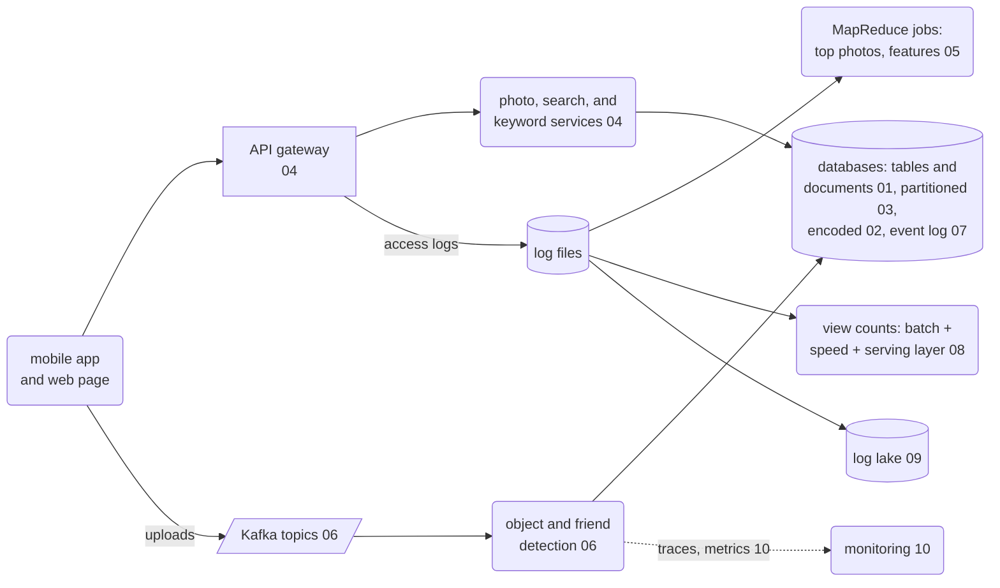

# Scaling the system: code for the lecture

Runnable examples for the lecture *Scaling the System* in *Machine Learning in Production*
(readings: the book chapter
[Scaling the System](https://mlip-cmu.github.io/book/12-scaling-the-system.html), and Martin
Kleppmann, *Designing Data-Intensive Applications*, O'Reilly, 2017).

**Case study: a photo service like Google Photos.** Users upload photos with a mobile app or
the web page. An ML model detects objects in each photo (keywords for the search), a second
model finds friends in the photos, and the service counts views and shows shared albums. All
projects use the same synthetic, deterministic dataset ([`photo-data`](photo-data/)): 300
users, 40,000 photos, shared albums, and three days of logs of all parts of the system
(web servers, services, deployments, logins, crash reports), with two hidden incidents.

## How to read and run

You can read everything on GitHub without running it:

- each project has a README with the problem, the idea, code excerpts, and the results;
- the notebooks (`03`, `07`) are committed with their outputs;
- the data is committed as CSV and log files in [`photo-data/data/`](photo-data/data/), and
  [`photo-data/data/preview/`](photo-data/data/preview/) has small extracts.

To run the code, install [uv](https://docs.astral.sh/uv/) and, for most projects,
[Docker](https://docs.docker.com/get-docker/) (Kafka, Hadoop, databases, and monitoring run
in containers; nothing else is needed). Every folder is its own uv project (Python 3.13);
`uv run` installs its dependencies. Each project README has the commands, for example:

```sh
cd 06-stream-processing
docker compose up -d --build     # start the servers and components of the project
uv run check_system.py           # run a demo
docker compose down -v           # stop and remove everything
./run_all.sh                     # run every project, as the CI does (about 30 minutes)
./run_all.sh 05-mapreduce 08-lambda-architecture
```

## Slides → code

| Slides | Project | Tools |
|---|---|---|
| Case Study | [`photo-data`](photo-data/) | pandas, NumPy |
| Data Storage Basics; Relational Data Models; Document Data Models; Log files, unstructured data; Tradeoffs | [`01-storage-models`](01-storage-models/) | PostgreSQL, MongoDB |
| Data Encoding | [`02-encoding`](02-encoding/) | CSV, JSON, Avro, Protocol Buffers, Parquet |
| Distributed Data Storage; Replication vs Partitioning; Partitioning | [`03-partitioning`](03-partitioning/) | consistent hashing, DuckDB, Jupyter |
| Data Processing (Overview); Microservices; API Gateway Pattern | [`04-microservices`](04-microservices/) | FastAPI, nginx |
| Batch Processing; Large Jobs; Distributed Batch Processing; MapReduce -- Functional Programming Style; Machine Learning and MapReduce; Dataflow Engines; Key Design Principle: Data Locality | [`05-mapreduce`](05-mapreduce/) | shell tools, Hadoop (HDFS, YARN, Streaming) |
| Stream Processing (e.g., Kafka); Messaging Systems; Common Designs; Stream Queries; Consumers; Design Questions; Stream Processing and AI-enabled Systems?; Reasoning about Dataflows | [`06-stream-processing`](06-stream-processing/) | Kafka, confluent-kafka |
| Event Sourcing; Benefits of Immutability (Event Sourcing); Drawbacks of Immutable Data | [`07-event-sourcing`](07-event-sourcing/) | SQLite, Jupyter |
| The Lambda Architecture; 3 Layer Storage Architecture; Lambda Architecture and Machine Learning | [`08-lambda-architecture`](08-lambda-architecture/) | Kafka, Redis, DuckDB, FastAPI |
| Data Lake | [`09-log-lake`](09-log-lake/) | Grafana Loki, LogQL, Drain3 |
| Profiling; Performance Monitoring of Distributed Systems | [`10-stream-monitoring`](10-stream-monitoring/) | OpenTelemetry, Jaeger, Prometheus, Grafana, pyinstrument |

## Where each technique sits in the system



## Continuous integration

`.github/workflows/demos.yml` checks the code with ruff, runs each project with
`./run_all.sh <project>` (with the servers in Docker), and checks that the committed data
files are the same as the output of the generator.
